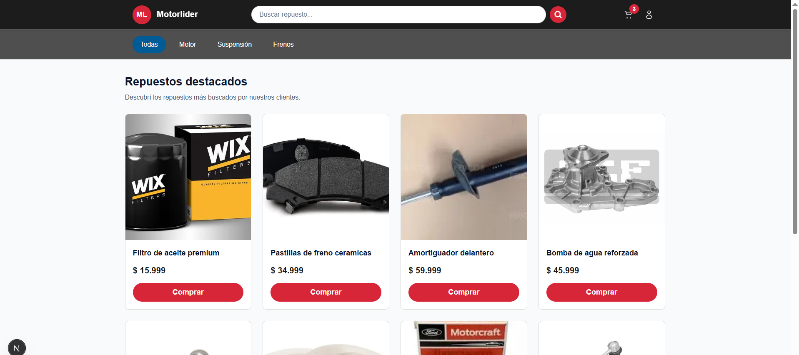

# Motorlider E-commerce Starter

Marketplace base para un e-commerce de repuestos de autos construido con **Next.js 15**, **TypeScript** y **TailwindCSS**. Este proyecto sirve como boilerplate para iterar sobre funcionalidades de catálogo, búsqueda y carrito con un enfoque modular y escalable.

## Captura de pantalla

## 🧱 Tech Stack

- Next.js 15 (App Router) + React 19
- TypeScript con strict: true
- TailwindCSS 4 + styles/theme.css para paleta y utilidades compartidas
- Zustand (estado global con persistencia en localStorage)
- React Query (reservado para futuras integraciones)

## ✨ Funcionalidades Implementadas

### UI & Estilos

- Paleta centralizada en src/styles/theme.css con clases .btn y .btn-primary reutilizables.
- Componentes base (Navbar, SearchBar, CategoryBar, ProductCard, Footer) con tipografía y espaciado consistente.
- Layouts responsive inspirados en marketplaces (sticky header, barra de categorías, cards con sombras suaves).

### Datos y Helpers

- Mocks tipados en src/data/categories.ts y src/data/products.ts con helpers getProductById, getPriceById y mapas de categorías.
- Formateo monetario con ormatCurrency (lib/format.ts).

### Estado Global

- Store de carrito en src/store/cart.ts con acciones dd,
  emove, setQty, clear y selectores useCartCount, useCartItems, useCartTotal.
- Persistencia en localStorage y helpers memorizados para consumo desde UI.

### Componentes Interactivos

- SearchBar con debounce (300 ms), sincronización con ?q= y filtro client-side por nombre/marca.
- CategoryBar sincronizada con ?cat= manteniendo cualquier query vigente.
- ToastProvider + useToast para notificaciones ("Producto agregado").
- ConfirmDialog accesible para confirmar eliminaciones y vaciado del carrito.

### Página de Carrito (/cart)

- Grid responsive (1 columna mobile / 2 columnas desktop) con cards/tabla modernizadas.
- Resumen sticky con total, CTA principal y botón de vaciado.
- Diálogo de confirmación para remover o vaciar productos.
- Estado vacío coherente con el look & feel de la home.

## 📁 Estructura Destacada

`src/
├─ app/
│  ├─ layout.tsx          # Layout raíz con ToastProvider
│  ├─ page.tsx            # Home con búsqueda y filtros
│  └─ cart/page.tsx       # Página de carrito
├─ components/            # Navbar, SearchBar, CategoryBar, ProductCard, Footer, ConfirmDialog, ToastProvider, etc.
├─ data/                  # Mocks y helpers de productos/categorías
├─ hooks/                 # useIsClient, useToast
├─ lib/                   # formatCurrency, constants
├─ store/                 # Zustand (cart)
├─ styles/                # theme.css con variables y helpers globales
└─ types/                 # Tipos compartidos (Product, Category, CartItem)`

## 🚀 Puesta en Marcha

`ash
npm install
npm run lint        # chequea el estilo y reglas ESLint
npm run dev         # levanta el entorno en http://localhost:3000
`

> Requisitos: Node.js 18+ (Next.js 15).

## ✅ Checklist Manual

- [x] Agregar productos desde las cards → contador de carrito + toast.
- [x] Cambiar cantidades/total en /cart.
- [x] Filtrar por texto y categoría usando ?q= y ?cat=.
- [x] Persistencia del carrito después de recargar.
- [x] Confirmar antes de eliminar o vaciar el carrito.

## 🔮 Próximos Pasos Sugeridos

1. Conectar API real (React Query) y reemplazar mocks.
2. Añadir flujo de checkout / autenticación.
3. Implementar tests (Jest + React Testing Library) para el store y componentes críticos.
4. Extender el sistema de toast con diferentes variantes (éxito/error).

---

Hecho con 💡 y foco en DX para acelerar la construcción del e-commerce Motorlider.
